# 🤝 Volunteer Seeking Mobile App

## 🧩 About

This documentation outlines the design and development of a **Volunteer Opportunity Mobile Application prototype** for **Project Compassion Ministry** at **Every Nation Auckland City (ENAC)** — a Christian church and non-profit organisation based in Auckland. This prototype was developed in collaboration with Project Compassion Ministry at Every Nation Auckland City (ENAC) and is shared publicly with permission from ENAC for portfolio demonstration purposes.

The app connects volunteers with charities by providing a **central platform** to discover and manage volunteer opportunities.

---

## 📱 Prerequisites

1. **Install Expo Go** (no registration required):
   - **iOS:** [Download from the App Store](https://apps.apple.com/us/app/expo-go/id982107779)
   - **Android:** [Download from Google Play](https://play.google.com/store/apps/details?id=host.exp.exponent)

---

## 🚀 Running the App

1. **How to view the app:**
   - Open **Expo Go** on your device.
   - Scan the QR code below, or visit the hosted link to preview.

👉 [Click here to open the Expo preview](https://expo.dev/preview/update?message=SDK+updated&updateRuntimeVersion=1.0.0&createdAt=2025-09-28T23%3A58%3A48.422Z&slug=exp&projectId=18eb286a-729b-4319-ab6f-e037c849b6a1&group=1a5f38ae-f4e5-4d87-a45b-074c13452d75)

If the link does not work, you can scan this QR code:

---

## 🗂️ High-Level File Structure

The following diagram shows the app’s **folder structure**:

- 🟧 **UI layer:** App screens and navigation (in `/app` folder)
- 🟩 **Business logic layer:** Reusable logic and database interaction (`/hooks`)
- 🟪 **Reusable UI components:** Shared input fields and UI elements (`/components`)
- 🟦 **Global state management:** Zustand store files (`/userStore`)

This structure follows the principle of **separation of concerns**, making the application **modular** and **easy to expand** in future updates.

---

## 🗄️ Database Diagram

Below is the implemented **database schema** using Firebase Firestore:

---

## 🔥 Firebase Service

The app integrates two Firebase services:

- **Authentication Service:**
  Handles user registration, login, and logout for all user types — Volunteers, Organisations, and ENAC staff.
  Stores encrypted authentication details (email/password).

- **Firestore:**
  Stores all other data such as users, opportunities, and applications.

> ⚙️ _Note: Currently migrating from Firebase to Supabase._

---

## 🏗️ Architecture Overview

The high-level system architecture is illustrated below:

### Layers Overview

1. **Frontend (React Native Expo)**

   - Cross-platform (iOS + Android)
   - Declarative rendering for efficient updates
   - File-based routing with **Expo Router**

2. **Backend (Firebase)**
   - Secure email/password authentication
   - Cloud Firestore database for real-time data
   - AsyncStorage for session management
   - Zustand for global state management

---

## 💡 Key Features (MVP)

### Volunteer Portal

- Secure login/signup/logout
- Browse, filter, and view volunteer opportunities
- Apply via partner organisation’s form
- Track recently visited opportunities
- Session persistence between app restarts

### Organisation Portal

- Create, update, delete, and view volunteering opportunities (CRUD)
- Manage opportunities awaiting Project Compassion approval
- View applicant (visited) lists
- Session persistence between app restarts

### Project Compassion Staff Portal

- Approve opportunities created by organisations
- Manage listings on behalf of organisations
- Monitor registered volunteers and organisations
- Track which volunteers visited which opportunities
- Session persistence for all admin users

---

## 📸 App Demo (Screenshots)

Here are some screenshots showcasing the key pages and interactions within the app:

### 🔹 Authentication & User Flow

| Choose Page                            | Volunteer Signup                         | Organisation Signup                      |
| -------------------------------------- | ---------------------------------------- | ---------------------------------------- |
| 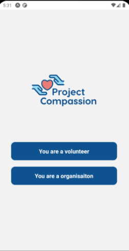 | 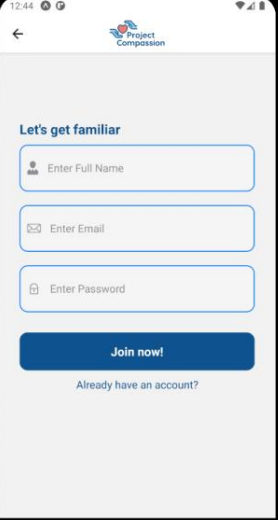 | 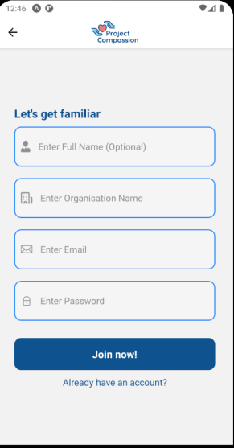 |

| Volunteer Login                          | Organisation Login                        | Admin Login                              |
| ---------------------------------------- | ----------------------------------------- | ---------------------------------------- |
| 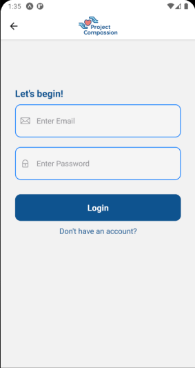 | ! | 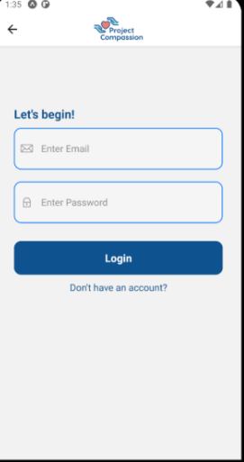 |

---

### 🔹 Volunteer Portal

| Opportunity List                         | Opportunity Detail                       | Filter Opportunities                     |
| ---------------------------------------- | ---------------------------------------- | ---------------------------------------- |
| 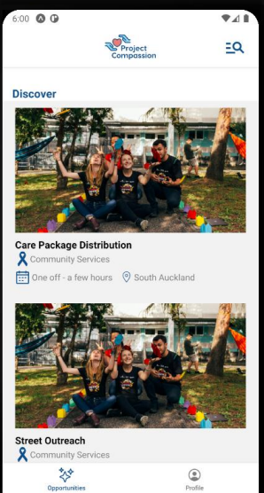 | 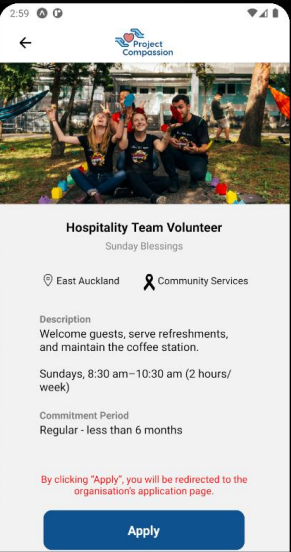 | 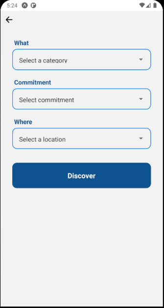 |

| Filtered                                 | Recently Visited List                     |     |
| ---------------------------------------- | ----------------------------------------- | --- |
| 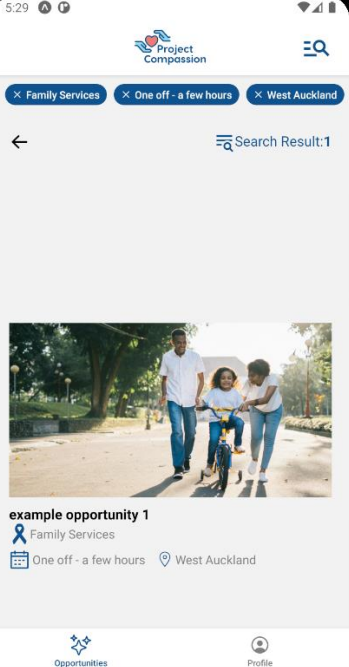 | 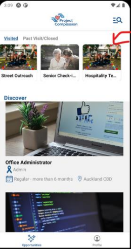 |     |

---

### 🔹 Organisation Portal

| Organisation Dashboard                    | Create Opportunity                        | Edit Opportunity                          |
| ----------------------------------------- | ----------------------------------------- | ----------------------------------------- |
| 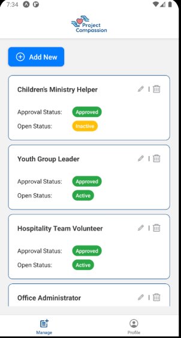 | 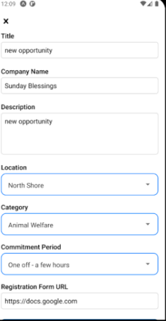 | 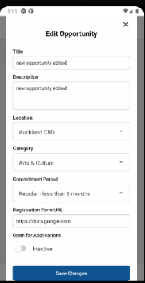 |

| Applicants List                           | Delete Post                               |     |
| ----------------------------------------- | ----------------------------------------- | --- |
| 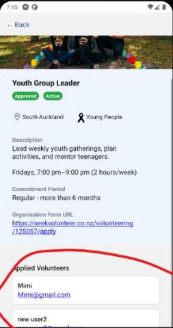 | 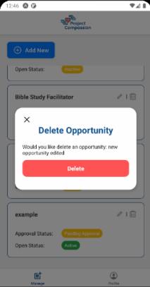 |     |

---

### 🔹 Project Compassion Admin Portal

| Pending Approval                          | Approve Opportunities                     | Approve Opportunity                       |
| ----------------------------------------- | ----------------------------------------- | ----------------------------------------- |
| 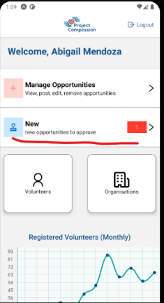 | 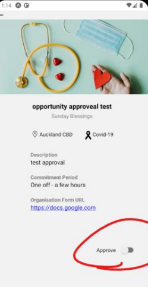 | 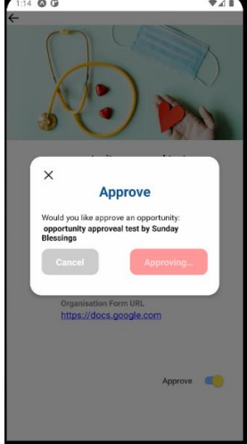 |

| Volunteer Overview                        | Organisation Overview                     | Manage Opportunity                        |
| ----------------------------------------- | ----------------------------------------- | ----------------------------------------- |
| 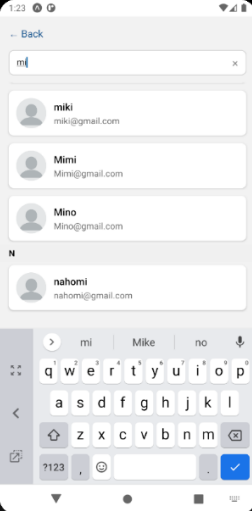 | 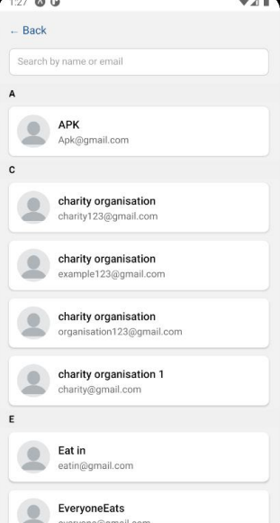 | 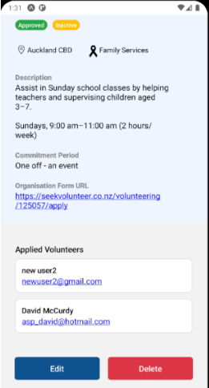 |

---

## 📊 Benefits

### For ENAC / Project Compassion Staff

- **Reduced admin workload** by automating coordination
- **Improved visibility** into volunteer engagement
- **Centralised control** of opportunities and approvals
- **Scalable management** as user base grows

### For Volunteers

- **Easier access** to volunteering opportunities
- **Filter and browse** by category, location, or commitment
- **Reduced dependency** on staff for updates

### For Partner Organisations

- **Wider reach** to potential volunteers
- **Autonomy** to manage and publish their own listings

---

## ⚙️ Technologies Used

| Category         | Tools / Frameworks               |
| ---------------- | -------------------------------- |
| Frontend         | React Native (Expo), Expo Router |
| Backend          | Firebase Auth, Firestore         |
| State Management | Zustand                          |
| Local Storage    | AsyncStorage                     |
| UI Libraries     | React Native Components          |
| Version Control  | Git & GitHub                     |

---

## 🧠 Skills Learned

- React Native Expo for cross-platform development
- Firebase Authentication & Firestore integration
- AsyncStorage for session handling
- Zustand for real-time state updates
- Expo Router file-based navigation
- Git workflow and project versioning
- Client communication & agile project management

---

## 🧪 Testing

- **Manual testing** after each major feature
- **Usability testing** with client and supervisor
- **Cross-device testing** (Android emulator + iPhone physical device)
- **Error handling** using Toast notifications (e.g. invalid email, weak password, missing fields)

---

## 🏁 Project Status

✅ The **prototype is fully functional** and meets all the deliverables defined in the project proposal.
All MVP features were implemented, and additional functionality such as approval workflow and applicant tracking were added based on client feedback.

---

## 📧 Client Acknowledgement

> “We truly appreciate the dedication and commitment you brought to every stage of the project.
> Your insights and suggestions significantly enhanced the functionality and overall user experience of the app.”
> — _Abigale Mendoza, Project Compassion (Every Nation Auckland City)_

---

## 📚 References

- [Expo Documentation](https://docs.expo.dev/router/introduction/)
- [Firebase Authentication](https://firebase.google.com/docs/auth/web/password-auth)
- [Firebase Firestore](https://firebase.google.com/docs/firestore)
- [Zustand GitHub Repository](https://github.com/pmndrs/zustand)
- [Every Nation Auckland City](https://www.everynationauckland.city/compassion)
- [Supabase Documentation](https://supabase.com/pricing)

---

**Author:** Ayako Naganeyama
**Bachelor of Digital Technologies (Level 7)**
**Manukau Institute of Technology | June 27, 2025**
